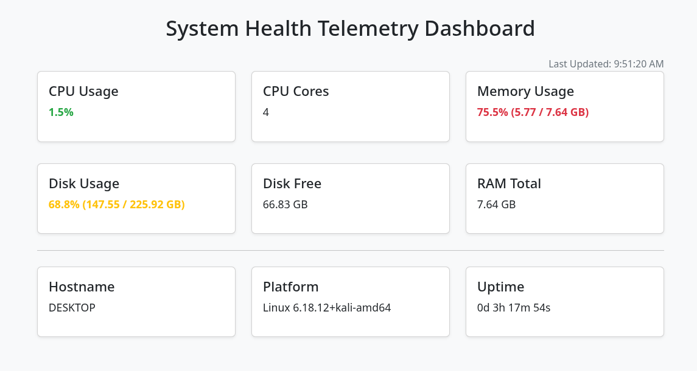

# System Health Telemetry Dashboard

[](https://www.python.org/)
[](https://fastapi.tiangolo.com/)
[](https://www.docker.com/)

---

## Table of Contents

1. [Project Overview](#project-overview)
2. [Features](#features)
3. [Tech Stack](#tech-stack)
4. [Setup & Installation](#setup--installation)
5. [Usage](#usage)
6. [Docker Deployment](#docker-deployment)
7. [API Endpoints](#api-endpoints)
8. [Screenshots](#screenshots)
9. [Testing](#testing)
10. [Recruiter & Resume Highlights](#recruiter--resume-highlights)
11. [License](#license)

---

## Project Overview

The **System Health Telemetry Dashboard** is a **real-time system monitoring tool** built with **FastAPI, Bootstrap, and Docker**.
It provides **live CPU, RAM, Disk metrics**, system info, and uptime in a **professional, responsive dashboard**.

This project demonstrates full-stack development, DevOps skills, and system-level monitoring.

---

## Features

- **Live Metrics:** CPU, RAM, Disk usage, Hostname, Platform, Uptime.
- **Color-Coded Indicators:**
  - Green: < 50% usage
  - Yellow: 50–75% usage
  - Red: > 75% usage
- **Real-Time Updates:** Auto-refresh every 5 seconds.
- **Responsive Design:** Works on desktop and mobile.
- **Dockerized:** Runs in a lightweight container with host-level metric access.
- **Fast API Responses:** Typically < 25ms.

---

## Tech Stack

| Layer      | Technology |
|-----------|------------|
| Backend   | FastAPI |
| Frontend  | HTML, Bootstrap 5, JavaScript |
| Container | Docker |
| Testing   | Pytest |
| OS Support| Linux, Windows, macOS (with adjustments) |

---

## Setup & Installation

1. **Clone the repository:**

```bash
git clone https://github.com/yaseen002/health-dashboard.git
cd health-dashboard
```

2. **Create Python virtual environment:**

```bash
python -m venv venv
source venv/bin/activate  # Linux/macOS
venv\Scripts\activate     # Windows
```

3. **Install dependencies:**

```bash
pip install -r requirements.txt
```

4. **Run the server:**

```bash
uvicorn app.main:app --reload
```

5. **Open in browser:**

```
http://127.0.0.1:8000
```

---

## Usage

* Dashboard auto-refreshes every 5 seconds.
* Watch live CPU, RAM, Disk usage, and system info.
* Color-coded metrics make high usage easy to identify.
* Compatible with desktops, tablets, and mobile devices.

---

## Docker Deployment

1. **Build Docker image:**

```bash
docker build -t health-dashboard .
```

2. **Run container with host metrics access:**

```bash
docker run -p 8080:8000 --pid=host health-dashboard
```

3. **Access dashboard:**

```
http://localhost:8080
```

✅ **Optimized container size:** \~120MB

---

## API Endpoints

| Endpoint       | Method | Description                           |
| ---------------- | -------- | --------------------------------------- |
| `/`        | GET    | Returns dashboard HTML                |
| `/metrics` | GET    | Returns JSON with live system metrics |
| `/health`  | GET    | Returns server health status          |

**Example `/metrics` response:**

```json
{
  "timestamp": "2026-04-08T14:32:45.123456",
  "cpu": {
    "percent": 45.2,
    "cores": 8
  },
  "memory": {
    "percent": 62.5,
    "total_gb": 16.0,
    "used_gb": 10.0,
    "available_gb": 6.0
  },
  "disk": {
    "percent": 58.3,
    "total_gb": 512.0,
    "free_gb": 213.0,
    "used_gb": 298.0
  },
  "system": {
    "hostname": "my-laptop",
    "platform": "Linux",
    "uptime_seconds": 345600
  }
}
```

---

## Screenshots

**Desktop View:**



---

## Testing

Run unit tests to validate metrics:

```bash
python -m pytest -v tests/test_metrics.py
```

✅ Expected Output:

```
2 passed in 1.05s
```

---

## License

MIT License © 2026

---
